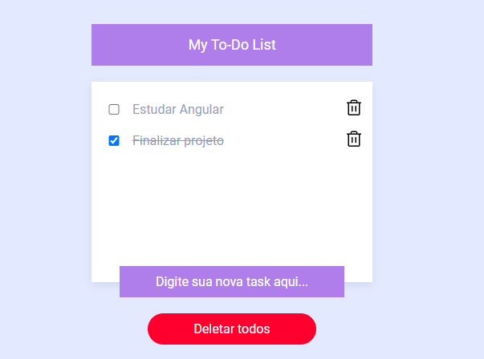

# ToDo List com Angular

Este é um projeto de exemplo desenvolvido como parte do aprendizado em Angular. O projeto implementa uma aplicação de ToDo List utilizando Angular e localStorage para armazenar os dados localmente.

## Sobre o Projeto

O projeto é uma aplicação de ToDo List que permite ao usuário adicionar, marcar como concluída e excluir tarefas. Ele utiliza o Angular para a criação da interface do usuário e o armazenamento local (localStorage) para manter os dados das tarefas.

## Funcionalidades

- Adicionar novas tarefas.
- Marcar as tarefas como concluídas.
- Excluir tarefas.
- Armazenamento local das tarefas utilizando localStorage.

## Estrutura do Projeto

O projeto possui a seguinte estrutura:

- `src/app`: Pasta que contém os componentes, serviços, módulos e arquivos relacionados à aplicação.
- `src/assets`: Pasta para armazenar arquivos estáticos como imagens, estilos CSS, etc.
- `src/environments`: Pasta para configurar variáveis de ambiente.

## Como Usar

1. Clone este repositório em sua máquina local.
2. Certifique-se de ter o Angular CLI instalado globalmente (`npm install -g @angular/cli`).
3. Navegue até o diretório do projeto e instale as dependências (`npm install`).
4. Execute o servidor de desenvolvimento (`ng serve`) e abra o navegador no endereço `http://localhost:4200`.

## Recursos Utilizados

- Angular
- TypeScript
- HTML
- CSS
- localStorage

## Contribuição

Este é um projeto em desenvolvimento. Contribuições são bem-vindas por meio de pull requests. Para grandes mudanças, por favor, abra uma issue primeiro para discutir o que você gostaria de mudar.

## Contato

Se tiver alguma dúvida ou sugestão relacionada a este projeto, sinta-se à vontade para entrar em contato.
